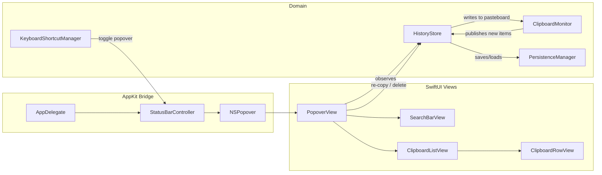

# Design Document: CopyCat — Clipboard Manager

## Overview

CopyCat is a native macOS 26 menu bar clipboard manager built with SwiftUI and the Liquid Glass design language. The app lives exclusively in the menu bar (no Dock icon), monitors the system clipboard for text and image content, and presents a searchable, keyboard-navigable history popover styled with Liquid Glass effects.

The architecture follows a clean separation between clipboard monitoring, data persistence, and UI presentation. The core data flow is:

1. **Clipboard Monitor** polls `NSPasteboard.general.changeCount` on a timer to detect new content.
2. New items are prepended to an in-memory **Clipboard History** model (capped at 50 items).
3. The history is persisted to a JSON file on disk whenever it changes.
4. The **Popover UI** binds to the history model and renders items in a scrollable, searchable list with native Liquid Glass styling.
5. **Re-copy** writes an item back to the pasteboard while setting a flag so the monitor ignores the self-initiated change.

```mermaid
flowchart TD
    subgraph System
        PB[NSPasteboard.general]
    end

    subgraph CopyCat
        CM[ClipboardMonitor] -->|polls changeCount| PB
        CM -->|new item detected| HS[HistoryStore]
        HS -->|persist| FS[(JSON File)]
        HS -->|@Published items| UI[PopoverView]
        UI -->|re-copy action| PB
        UI -->|delete / clear| HS
        SB[StatusBarController] -->|toggle| UI
        KB[KeyboardShortcutManager] -->|Cmd+Shift+V| SB
    end
```

### Key Design Decisions

| Decision | Rationale |
|---|---|
| Poll `NSPasteboard.changeCount` via `Timer` | macOS provides no push notification for pasteboard changes; polling `changeCount` is the standard approach used by all major clipboard managers. A 0.5 s interval balances responsiveness with CPU cost. |
| JSON file persistence (not Core Data / SQLite) | The data set is small (≤50 items). A single JSON file is simpler to implement, debug, and reason about. Images are stored as Base64-encoded PNG within the JSON. |
| `NSStatusItem` + `NSPopover` (AppKit bridge) | SwiftUI's `MenuBarExtra` does not support the level of popover customization needed (sizing, keyboard focus, dismiss behavior). A thin AppKit bridge gives full control while the popover content is pure SwiftUI. |
| Liquid Glass via `.glassEffect()` | Aligns with macOS 26 design language. Applied to the popover container and interactive list rows per the Liquid Glass skill patterns. |
| `SwiftCheck` for property-based testing | Mature QuickCheck-style library for Swift with `Arbitrary` protocol support, suitable for testing serialization round-trips and history invariants. |

## Architecture



The app is structured into three layers:

### 1. AppKit Bridge Layer
- **AppDelegate**: Configures `NSApplication` as accessory (no Dock icon), creates the status bar controller, and starts the clipboard monitor.
- **StatusBarController**: Owns the `NSStatusItem` and `NSPopover`. Handles show/dismiss logic and positions the popover below the menu bar icon.
- **KeyboardShortcutManager**: Registers the global `Cmd+Shift+V` hotkey using `NSEvent.addGlobalMonitorForEvents` combined with a local monitor, and forwards toggle events to the `StatusBarController`.

### 2. SwiftUI View Layer
- **PopoverView**: Root view inside the popover. Contains the search bar, clipboard list, and "Clear All" button. Wrapped in a `GlassEffectContainer`.
- **SearchBarView**: Text field with a search icon. Binds to a `searchQuery` string on the `HistoryStore`.
- **ClipboardListView**: `ScrollView` + `LazyVStack` rendering `ClipboardRowView` for each item. Supports arrow-key navigation via `@FocusState`.
- **ClipboardRowView**: Displays a single clipboard item — text preview or image thumbnail, timestamp, and Liquid Glass `.glassEffect(.regular.interactive())` styling.

### 3. Domain Layer
- **ClipboardMonitor**: `@Observable` class that runs a `Timer` polling `NSPasteboard.general.changeCount`. When a change is detected and the `ignoreSelfWrite` flag is not set, it extracts text or image content and passes it to the `HistoryStore`.
- **HistoryStore**: `@Observable` class holding the `[ClipboardItem]` array. Provides methods for adding, deleting, clearing, re-copying, and searching. Coordinates with `PersistenceManager` on every mutation.
- **PersistenceManager**: Handles encoding/decoding `[ClipboardItem]` to/from a JSON file in the app's Application Support directory.

## Components and Interfaces

### ClipboardItem

```swift
enum ClipboardItemContent: Codable, Equatable {
    case text(String)
    case image(Data) // PNG data
}

struct ClipboardItem: Identifiable, Codable, Equatable {
    let id: UUID
    let content: ClipboardItemContent
    let createdAt: Date
}
```

### ClipboardMonitor

```swift
@Observable
final class ClipboardMonitor {
    private var timer: Timer?
    private var lastChangeCount: Int
    private var ignoreSelfWrite: Bool = false

    func startMonitoring()
    func stopMonitoring()
    func setIgnoreSelfWrite()  // Called before writing to pasteboard

    // Callback when new content is detected
    var onNewContent: ((ClipboardItemContent) -> Void)?
}
```

**Behavior**:
- Polls `NSPasteboard.general.changeCount` every 0.5 seconds.
- When `changeCount` changes and `ignoreSelfWrite` is `false`, reads the pasteboard for `NSPasteboardTypeString` or `NSPasteboardTypeTIFF`/`NSPasteboardTypePNG`.
- Text is extracted as `String`; images are converted to PNG `Data` via `NSBitmapImageRep`.
- Calls `onNewContent` with the extracted content.
- When `ignoreSelfWrite` is `true`, the next detected change resets the flag without creating an item.

### HistoryStore

```swift
@Observable
final class HistoryStore {
    private(set) var items: [ClipboardItem] = []
    var searchQuery: String = ""

    var filteredItems: [ClipboardItem]  // Computed: filters by searchQuery
    var matchCount: Int                 // Count of filteredItems

    func addItem(_ content: ClipboardItemContent)
    func deleteItem(_ item: ClipboardItem)
    func clearAll()
    func recopy(_ item: ClipboardItem, monitor: ClipboardMonitor)
    func loadFromDisk()
    func saveToDisk()
}
```

**Behavior**:
- `addItem`: Checks for duplicate against the most recent item. If not a duplicate, prepends a new `ClipboardItem`. If the list exceeds 50 items, removes the oldest. Calls `saveToDisk()`.
- `deleteItem`: Removes the item by ID. Calls `saveToDisk()`.
- `clearAll`: Empties the array. Calls `saveToDisk()`.
- `recopy`: Calls `monitor.setIgnoreSelfWrite()`, then writes the item's content to `NSPasteboard.general`.
- `filteredItems`: When `searchQuery` is non-empty, returns text items whose content contains the query (case-insensitive). Image items are excluded from search results. When `searchQuery` is empty, returns all items.

### PersistenceManager

```swift
struct PersistenceManager {
    static let fileURL: URL  // ~/Library/Application Support/CopyCat/history.json

    static func save(_ items: [ClipboardItem]) throws
    static func load() throws -> [ClipboardItem]
}
```

**Behavior**:
- Uses `JSONEncoder` / `JSONDecoder` with `.iso8601` date strategy.
- Image data is encoded as Base64 within the JSON (handled automatically by `Codable` `Data` encoding).
- Creates the Application Support subdirectory if it doesn't exist.

### StatusBarController

```swift
final class StatusBarController {
    private var statusItem: NSStatusItem
    private var popover: NSPopover

    func setup(with contentView: some View)
    func togglePopover()
    func showPopover()
    func dismissPopover()
}
```

**Behavior**:
- Creates `NSStatusBar.system.statusItem(withLength:)` with a clipboard SF Symbol icon (`doc.on.clipboard`), set as template image.
- Configures `NSPopover` with `.contentSize` of 320×480 points and `.behavior = .transient` (auto-dismiss on outside click).
- `togglePopover` shows or hides based on current state.

### KeyboardShortcutManager

```swift
final class KeyboardShortcutManager {
    private var globalMonitor: Any?
    private var localMonitor: Any?

    func register(toggle: @escaping () -> Void)
    func unregister()
}
```

**Behavior**:
- Uses `NSEvent.addGlobalMonitorForEvents(matching: .keyDown)` to detect `Cmd+Shift+V` when the app is not focused.
- Uses `NSEvent.addLocalMonitorForEvents(matching: .keyDown)` for when the app is focused.
- Calls the `toggle` closure on match.

### PopoverView

```swift
struct PopoverView: View {
    @Bindable var store: HistoryStore
    var monitor: ClipboardMonitor
    var onDismiss: () -> Void

    @State private var focusedIndex: Int?

    var body: some View  // GlassEffectContainer wrapping search + list + clear button
}
```

### ClipboardRowView

```swift
struct ClipboardRowView: View {
    let item: ClipboardItem
    let isFocused: Bool

    var body: some View  // Row with glass effect, preview, and timestamp
}
```

**Text preview**: Truncates to 80 characters with `"…"` suffix.
**Image preview**: `Image(nsImage:)` with `.frame(maxHeight: 60)` and `.aspectRatio(contentMode: .fit)`.
**Timestamp**: `RelativeDateTimeFormatter` for human-readable relative times.

## Data Models

### ClipboardItem

| Field | Type | Description |
|---|---|---|
| `id` | `UUID` | Unique identifier, generated on creation |
| `content` | `ClipboardItemContent` | `.text(String)` or `.image(Data)` where Data is PNG bytes |
| `createdAt` | `Date` | Timestamp of when the item was captured |

### ClipboardItemContent (enum)

| Case | Associated Value | Description |
|---|---|---|
| `.text` | `String` | UTF-8 text content from the clipboard |
| `.image` | `Data` | PNG-encoded image data |

### Persistence Format

The history is stored as a JSON array at `~/Library/Application Support/CopyCat/history.json`:

```json
[
  {
    "id": "550e8400-e29b-41d4-a716-446655440000",
    "content": { "text": "Hello, world!" },
    "createdAt": "2025-06-15T10:30:00Z"
  },
  {
    "id": "6ba7b810-9dad-11d1-80b4-00c04fd430c8",
    "content": { "image": "<base64-encoded PNG>" },
    "createdAt": "2025-06-15T10:29:00Z"
  }
]
```

### State Model

| Property | Type | Owner | Description |
|---|---|---|---|
| `items` | `[ClipboardItem]` | `HistoryStore` | Full clipboard history, ordered newest-first |
| `searchQuery` | `String` | `HistoryStore` | Current search filter text |
| `filteredItems` | `[ClipboardItem]` | `HistoryStore` (computed) | Items matching the search query |
| `isPopoverShown` | `Bool` | `StatusBarController` | Whether the popover is currently visible |
| `focusedIndex` | `Int?` | `PopoverView` | Currently keyboard-focused item index |
| `lastChangeCount` | `Int` | `ClipboardMonitor` | Last observed `NSPasteboard.changeCount` |
| `ignoreSelfWrite` | `Bool` | `ClipboardMonitor` | Flag to skip the next pasteboard change |


## Correctness Properties

*A property is a characteristic or behavior that should hold true across all valid executions of a system — essentially, a formal statement about what the system should do. Properties serve as the bridge between human-readable specifications and machine-verifiable correctness guarantees.*

### Property 1: Content prepend

*For any* valid clipboard content (text string or image data), adding it to a non-duplicate history should result in the new item appearing at index 0 of the history, and the history length increasing by exactly one.

**Validates: Requirements 2.2, 2.3**

### Property 2: Duplicate discard

*For any* clipboard content that is identical to the most recent item in the history, attempting to add it should leave the history completely unchanged — same items, same order, same length.

**Validates: Requirements 2.4**

### Property 3: Newest-first ordering invariant

*For any* sequence of add and delete operations on the history, the resulting list of items should always be ordered by `createdAt` descending (newest first).

**Validates: Requirements 3.1**

### Property 4: Text preview truncation

*For any* text string, the preview function should return a string of at most 80 characters. If the original string exceeds 80 characters, the preview should end with an ellipsis (`…`) and have a total length of 80. If the original string is 80 characters or fewer, the preview should equal the original.

**Validates: Requirements 3.2**

### Property 5: Re-copy preserves history

*For any* history and any item within it, performing a re-copy operation on that item should not change the history — the list of items, their order, and their content should remain identical before and after the re-copy.

**Validates: Requirements 4.3**

### Property 6: Delete removes exactly one item

*For any* non-empty history and any item within it, deleting that item should reduce the history length by exactly one, the deleted item should no longer appear in the history, and all other items should remain in their original order.

**Validates: Requirements 5.2**

### Property 7: History cap with eviction

*For any* history (including a full history of 50 items), after adding a new non-duplicate item, the history length should be at most 50, the new item should be at index 0, and if the history was previously at capacity, the oldest item (last in the list) should have been removed.

**Validates: Requirements 6.3, 6.4**

### Property 8: Serialization round-trip

*For any* valid `ClipboardItem` (text with arbitrary UTF-8 strings, or image with arbitrary PNG data), encoding it to JSON and then decoding it back should produce a `ClipboardItem` that is equal to the original.

**Validates: Requirements 6.5, 6.6**

### Property 9: Search filter correctness

*For any* history containing a mix of text and image items, and any non-empty search query string, the filtered results should satisfy: (a) every result is a text item, (b) every result's text content contains the query string case-insensitively, and (c) no text item in the original history that contains the query is missing from the results.

**Validates: Requirements 7.2**

## Error Handling

### Pasteboard Read Failures

- If `NSPasteboard.general` contains no recognized types (neither string nor image), the monitor silently skips the change. No error is surfaced to the user.
- If image data cannot be converted to PNG via `NSBitmapImageRep`, the item is skipped and a warning is logged to `os_log`.

### Persistence Failures

- If the JSON file is corrupted or cannot be decoded, `PersistenceManager.load()` returns an empty array and logs a warning. The app starts with an empty history rather than crashing.
- If writing to disk fails (permissions, disk full), the error is logged but the in-memory history remains intact. The next mutation will retry the save.
- The Application Support directory is created with `createDirectory(withIntermediateDirectories: true)` on first save.

### Pasteboard Write Failures (Re-copy)

- If writing to `NSPasteboard.general` fails during re-copy, the error is logged and the popover remains open (no dismiss) so the user can retry.
- The `ignoreSelfWrite` flag is only set after a successful write to avoid desynchronization.

### Edge Cases

- **Empty pasteboard**: If the pasteboard is cleared externally, the monitor detects a `changeCount` change but finds no recognized content — it silently skips.
- **Very large images**: Images are stored as PNG data. If an image exceeds a reasonable size (e.g., >10 MB), it is skipped to avoid bloating the history file.
- **Rapid clipboard changes**: The 0.5s polling interval means rapid successive copies may only capture the last one. This is acceptable behavior — the most recent content is always captured.
- **App termination during save**: Since the JSON file is written atomically (write to temp file, then rename), partial writes cannot corrupt the history.

## Testing Strategy

### Unit Tests (Example-Based)

Unit tests cover specific scenarios, edge cases, and integration points:

| Test | Validates |
|---|---|
| App creates NSStatusItem on launch | Req 1.1 |
| App activation policy is .accessory (no Dock icon) | Req 1.2 |
| Clicking status item toggles popover | Req 1.3 |
| Popover behavior is .transient | Req 1.4 |
| Self-write flag prevents duplicate item creation | Req 2.5 |
| Empty history shows placeholder view | Req 3.6 |
| Image thumbnail has max height of 60 points | Req 3.3 |
| RelativeDateTimeFormatter produces expected output for known dates | Req 3.4 |
| Re-copy dismisses popover | Req 4.2 |
| Right-click shows context menu with Delete | Req 5.1 |
| Clear All empties the history | Req 5.3 |
| Clear All shows confirmation prompt | Req 5.4 |
| Load from disk restores known history | Req 6.2 |
| Corrupted JSON file results in empty history | Error handling |
| Arrow keys move focus through list | Req 8.2 |
| Enter re-copies focused item | Req 8.3 |
| Escape dismisses popover | Req 8.4 |

### Property-Based Tests (SwiftCheck)

Property-based tests use [SwiftCheck](https://github.com/typelift/SwiftCheck) to verify universal properties across randomly generated inputs. Each test runs a minimum of 100 iterations.

| Property Test | Tag | Validates |
|---|---|---|
| Content prepend | Feature: clipboard-manager, Property 1: Content prepend | Req 2.2, 2.3 |
| Duplicate discard | Feature: clipboard-manager, Property 2: Duplicate discard | Req 2.4 |
| Newest-first ordering | Feature: clipboard-manager, Property 3: Newest-first ordering invariant | Req 3.1 |
| Text preview truncation | Feature: clipboard-manager, Property 4: Text preview truncation | Req 3.2 |
| Re-copy preserves history | Feature: clipboard-manager, Property 5: Re-copy preserves history | Req 4.3 |
| Delete removes exactly one | Feature: clipboard-manager, Property 6: Delete removes exactly one item | Req 5.2 |
| History cap with eviction | Feature: clipboard-manager, Property 7: History cap with eviction | Req 6.3, 6.4 |
| Serialization round-trip | Feature: clipboard-manager, Property 8: Serialization round-trip | Req 6.5, 6.6 |
| Search filter correctness | Feature: clipboard-manager, Property 9: Search filter correctness | Req 7.2 |

**Generator Strategy**:
- `ClipboardItemContent` generator: produces `.text(String)` with arbitrary Unicode strings and `.image(Data)` with small random PNG byte sequences.
- `ClipboardItem` generator: combines a random UUID, random content, and random `Date`.
- History generator: produces arrays of 0–60 `ClipboardItem` values to test both under-capacity and over-capacity scenarios.
- Search query generator: produces random substrings of items in the history to ensure meaningful matches, plus fully random strings to test no-match cases.

### Integration Tests

| Test | Validates |
|---|---|
| Persistence round-trip: save history to disk, load it back, verify equality | Req 6.1 |
| Global keyboard shortcut registration and toggle | Req 8.1 |
| Launch-at-login preference registration | Req 1.5 |

### Test Configuration

- **Framework**: Swift Testing (`@Test`, `#expect`) for unit and integration tests
- **PBT Library**: SwiftCheck (added as a Swift Package dependency, test target only)
- **Minimum PBT iterations**: 100 per property
- **CI**: All tests run on macOS 26 runners via `swift test`
