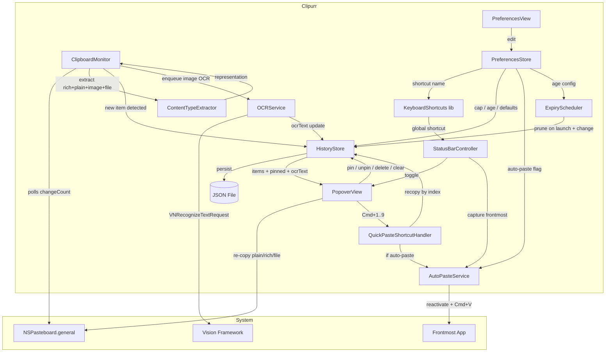
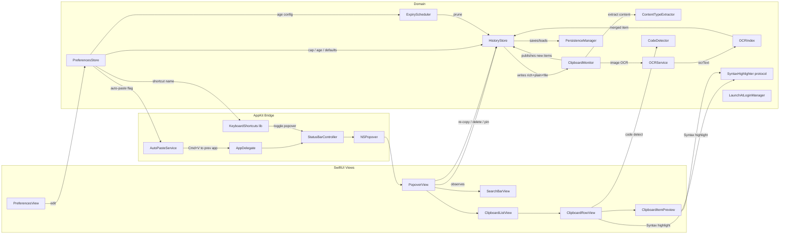

# Design Document: Clipurr — Clipboard Manager

## Overview

Clipurr is a native macOS 26 menu bar clipboard manager built with SwiftUI and the Liquid Glass design language. The app lives exclusively in the menu bar (no Dock icon), monitors the system clipboard for text, image, and file content, and presents a searchable, keyboard-navigable history popover styled with Liquid Glass effects.

The baseline (Requirements 1–8) is already implemented. This design extends the existing shape with the following capabilities from Requirements 9–17 without replacing any core component:

- **On-device OCR** for images via Apple's Vision framework, making screenshots searchable.
- **Rich clipboard content** (RTF/HTML) preservation and a library-agnostic `SyntaxHighlighter` for code.
- **User-customizable global shortcut** via the `KeyboardShortcuts` package, plus Cmd+1…Cmd+9 quick-paste and opt-in auto-paste into the previously focused app.
- **Pinned items**, exempt from eviction by cap or age.
- **Space-key preview** that routes through the same `ClipboardItemPreview` component already used by Force Touch deep press — there is no separate Quick Look panel.
- **Drag-out** support so rows can be dragged into other apps.
- **Configurable history cap and age-based expiry**, with pinned items excluded from both.
- **Smart dedup** — re-copying existing content promotes it to the top rather than duplicating.
- **File reference items** captured from `public.file-url`.

The core data flow is preserved: a polling **Clipboard Monitor** detects changes, the **HistoryStore** keeps the in-memory history, **PersistenceManager** writes JSON, and the **PopoverView** renders it. The extensions slot into existing layers:

1. **Clipboard Monitor** still polls `NSPasteboard.general.changeCount`, but now delegates content extraction to `ContentTypeExtractor` (plain/RTF/HTML/image/file), and kicks off OCR for image items.
2. **HistoryStore** is extended with smart dedup, pin/unpin, cap/age enforcement, and rich-preserving re-copy.
3. **PreferencesStore** (new) is an `@Observable` store backed by `UserDefaults` that exposes the global shortcut name, history cap, age expiry, default re-copy format, and auto-paste toggle.
4. **AutoPasteService** (new) captures the previously frontmost app when the popover opens and, when auto-paste is enabled, reactivates it and synthesizes Cmd+V via `CGEvent`.
5. **PreferencesView** (new Settings scene) replaces the placeholder `Settings { EmptyView() }` with the configuration surface.



### Key Design Decisions

| Decision | Rationale |
|---|---|
| Poll `NSPasteboard.changeCount` via `Timer` | macOS provides no push notification for pasteboard changes; polling `changeCount` is the standard approach used by all major clipboard managers. A 0.5 s interval balances responsiveness with CPU cost. |
| JSON file persistence (not Core Data / SQLite) | The data set is small (≤50 items). A single JSON file is simpler to implement, debug, and reason about. Images are stored as Base64-encoded PNG within the JSON. |
| `NSStatusItem` + `NSPopover` (AppKit bridge) | SwiftUI's `MenuBarExtra` does not support the level of popover customization needed (sizing, keyboard focus, dismiss behavior). A thin AppKit bridge gives full control while the popover content is pure SwiftUI. |
| Liquid Glass via `.glassEffect()` | Aligns with macOS 26 design language. Applied to the popover container and interactive list rows per the Liquid Glass skill patterns. |
| `SwiftCheck` for property-based testing | Mature QuickCheck-style library for Swift with `Arbitrary` protocol support, suitable for testing serialization round-trips and history invariants. |
| `KeyboardShortcuts` (Sindre Sorhus) for the customizable global shortcut | Ships a ready-made `KeyboardShortcuts.Recorder` view, persistence in `UserDefaults`, conflict detection, and global hotkey registration, so we do not reinvent `CGEventTap` / `RegisterEventHotKey` ourselves. Replaces the hand-rolled `KeyboardShortcutManager`. |
| Apple Vision `VNRecognizeTextRequest` for OCR | On-device, no network, and already supports the languages required. Runs off the main actor on an async queue; results are written back on the main actor. |
| Library-agnostic `SyntaxHighlighter` protocol | Requirement 10 leaves the concrete library open (Splash vs Sourceful). The design exposes a one-method protocol returning `NSAttributedString` so either library can plug in behind it without changing callers. |
| One unified preview surface | Requirement 13 explicitly rejects a separate Quick Look panel. The existing `ClipboardItemPreview` shown in a `.popover` is the single `Detail_Preview`. Space and Force Touch both toggle the same `isShowingPreview` state on the row. |
| Auto-paste via `CGEvent` with captured frontmost app | Quick-paste needs to paste into the user's previous app, not Clipurr. `NSWorkspace.shared.frontmostApplication` is snapshotted when the popover opens, then reactivated before synthesizing Cmd+V. Requires Accessibility trust, prompted via `AXIsProcessTrusted`. |

## Architecture



The app is structured into three layers, preserved from the baseline design and extended for the new features:

### 1. AppKit Bridge Layer
- **AppDelegate**: Configures `NSApplication` as accessory (no Dock icon), creates the status bar controller, starts the clipboard monitor, and wires `AutoPasteService` and `KeyboardShortcuts` listeners.
- **StatusBarController**: Owns the `NSStatusItem` and `NSPopover`. Handles show/dismiss logic and positions the popover below the menu bar icon. On show, asks `AutoPasteService` to capture the current frontmost app so quick-paste can later restore focus.
- **`KeyboardShortcuts` library** (github.com/sindresorhus/KeyboardShortcuts): Replaces the hand-rolled `KeyboardShortcutManager`. Provides the `KeyboardShortcuts.Name` registry, persistence in `UserDefaults`, `KeyboardShortcuts.Recorder` SwiftUI view for Preferences, conflict detection, and global hotkey registration. The existing `Cmd+Shift+V` default is preserved as `KeyboardShortcuts.Name.togglePopover.defaultShortcut`.
- **AutoPasteService**: Captures `NSWorkspace.shared.frontmostApplication` when the popover is shown, restores it on quick-paste, and synthesizes Cmd+V using `CGEvent`. Handles Accessibility permission checks via `AXIsProcessTrusted()` and surfaces a one-time alert when permission is denied.

### 2. SwiftUI View Layer
- **PopoverView**: Root view inside the popover. Contains the search bar, clipboard list, and "Clear All" button. Wrapped in a `GlassEffectContainer`. Hosts `isShowingPreview` state and the quick-paste key handler.
- **SearchBarView**: Text field with a search icon. Binds to a `searchQuery` string on the `HistoryStore`.
- **ClipboardListView**: `ScrollView` + `LazyVStack` rendering `ClipboardRowView` for each item. Supports arrow-key navigation via `@FocusState`, Cmd+1…Cmd+9 quick-paste via a local `.onKeyPress` handler, and the Space key to open the shared `ClipboardItemPreview` for the focused row.
- **ClipboardRowView**: Displays a single clipboard item — text preview, image thumbnail, or file row — with a pin indicator overlay when pinned, timestamp, and Liquid Glass styling. Carries the `.onDrag` modifier for drag-out. The existing `PressureClickCatcher` overlay drives Force Touch preview; the list-level Space key handler drives the exact same preview popover.
- **ClipboardItemPreview**: The one and only `Detail_Preview` component. Used by both Force Touch deep press (from `ClipboardRowView`) and Space key (from `ClipboardListView`). Extended to render file items (icon, name, path, Reveal in Finder), rich text (via `NSAttributedString` from RTF/HTML or `SyntaxHighlighter`), and an OCR text panel beneath the image when present.
- **PreferencesView**: A `Settings` scene with sections for General, Shortcuts, History, and Quick Paste. Replaces the current `Settings { EmptyView() }`. Uses `KeyboardShortcuts.Recorder` for the global shortcut field.

### 3. Domain Layer
- **ClipboardMonitor**: `@Observable` class that runs a `Timer` polling `NSPasteboard.general.changeCount`. Delegates content extraction to `ContentTypeExtractor`, routes image items to `OCRService`, and passes the resulting item representation to `HistoryStore`.
- **ContentTypeExtractor**: Pure function over an `NSPasteboard` that returns the richest available representation — plain text plus optional RTF and HTML, a PNG image, or a list of file URLs.
- **OCRService**: Async, off-main-actor service over `VNRecognizeTextRequest`. Takes PNG `Data`, returns a `String`. Failures return empty string and log.
- **OCRIndex**: In-memory `[UUID: String]` map keyed by `ClipboardItem.id`. Merged onto the persisted `ClipboardItem.ocrText` field so OCR survives restarts.
- **SyntaxHighlighter** (protocol): `func highlight(_ source: String, language: String?) -> NSAttributedString`. Library-agnostic; the concrete implementation is chosen at build time.
- **CodeDetector**: Heuristic `(source: String) -> (isCode: Bool, language: String?)` used to decide whether to invoke the `SyntaxHighlighter` on a plain-text item that lacks Rich_Clipboard_Content.
- **HistoryStore**: `@Observable` class holding `[ClipboardItem]`. Extended with smart dedup, `togglePin`, `enforceCap`, `enforceAgeExpiry`, rich-preserving `recopy`, and sort-with-pinned-first.
- **PersistenceManager**: Handles encoding/decoding `[ClipboardItem]` to/from a JSON file. Unchanged in shape; the extended `ClipboardItem` fields decode via `decodeIfPresent` so older files still load.
- **PreferencesStore**: `@Observable` class backed by `UserDefaults`. Sole owner of the tunable configuration: global shortcut name, history cap, age expiry, default re-copy format, auto-paste flag. Writes propagate automatically through property observers.
- **ExpiryScheduler**: Runs a lightweight timer (and also on app launch and on `PreferencesStore` changes) that asks `HistoryStore.enforceAgeExpiry(days:)` to prune stale non-pinned items.
- **LaunchAtLoginManager**: Existing; unchanged.

## Components and Interfaces

### ClipboardItem (extended)

```swift
enum ClipboardItemContent: Codable, Equatable {
    case text(String)
    case image(Data)       // PNG data
    case file([URL])       // NEW: one or more file URLs from `public.file-url`
}

struct ClipboardItem: Identifiable, Codable, Equatable {
    let id: UUID
    let content: ClipboardItemContent
    let createdAt: Date

    // Extended fields — all optional for backward compatibility.
    // Decoding an older JSON document without them must succeed.
    var isPinned: Bool = false
    var rtfData: Data? = nil   // Captured when RTF is on the pasteboard
    var htmlData: Data? = nil  // Captured when HTML is on the pasteboard
    var ocrText: String? = nil // Populated asynchronously by OCRService
}
```

The custom `init(from:)` uses `decodeIfPresent` for every extended field and falls back to the defaults shown above so that any `history.json` produced by the existing build continues to decode cleanly. `Equatable` compares on `id`, `content`, `createdAt`, `isPinned`, `rtfData`, `htmlData`, and `ocrText`; two items with the same content but different rich-variants are considered different items so rich changes are observable to the UI.

### ClipboardMonitor (extended)

```swift
@Observable
final class ClipboardMonitor {
    private var timer: Timer?
    private var lastChangeCount: Int
    private var ignoreSelfWrite: Bool = false

    private let extractor: ContentTypeExtractor
    private let ocrService: OCRService

    func startMonitoring()
    func stopMonitoring()
    func setIgnoreSelfWrite()  // Called before writing to pasteboard

    // Callback when new content (or a freshly-deduped existing item) is detected.
    // The representation carries plain text + optional rich variants, or image, or files.
    var onNewContent: ((ClipboardItemRepresentation) -> Void)?

    // Callback that fires when async OCR completes for an image item.
    var onOCRCompleted: ((UUID, String) -> Void)?
}

/// The shape produced by ContentTypeExtractor and handed to HistoryStore.
struct ClipboardItemRepresentation: Equatable {
    enum Payload: Equatable {
        case text(plain: String, rtf: Data?, html: Data?)
        case image(Data)
        case file([URL])
    }
    let payload: Payload
}
```

**Behavior** (extended):
- Polls `NSPasteboard.general.changeCount` every 0.5 seconds.
- On each observed change, calls `ContentTypeExtractor.extract(from: .general)` to obtain the richest representation (plain + rich for text; PNG for image; URL list for files).
- Hands the representation to `HistoryStore.addRepresentation(_:)` (new name for the extended add path).
- If the representation is an image, enqueues an `OCRService.recognize(imageData:)` task; when it completes, calls `onOCRCompleted(id, text)`, which `HistoryStore` handles by updating the item's `ocrText` and re-persisting.
- `ignoreSelfWrite` semantics from the baseline are preserved: re-copy sets the flag and the next change is consumed silently.

### ContentTypeExtractor (new)

```swift
enum ContentTypeExtractor {
    static func extract(from pasteboard: NSPasteboard) -> ClipboardItemRepresentation?
}
```

**Behavior**:
- Checks for `public.file-url` / `NSPasteboardTypeFileURL` first. When present, reads all file URL items (supports multi-file Finder copies) and returns `.file([URL])`.
- If file URLs aren't present, reads `.string` for plain text. Alongside, tries to read `.rtf` and `public.html`. Returns `.text(plain:rtf:html:)` with whichever rich variants were found. The plain string is derived from the RTF/HTML when plain is missing but rich is present, via `NSAttributedString(data:options:documentAttributes:)`.
- Otherwise reads PNG (or TIFF, converted to PNG via `NSBitmapImageRep`) and returns `.image(Data)`.
- Rejects images larger than the existing 10 MB threshold.
- Returns `nil` when no recognized type is found.

### OCRService (new)

```swift
actor OCRService {
    var recognitionLanguages: [String] = ["en-US", "de-DE", "fr-FR", "es-ES",
                                          "it-IT", "pt-BR", "ja-JP", "zh-Hans"]
    func recognize(imageData: Data) async -> String
}
```

**Behavior**:
- Builds a `VNRecognizeTextRequest` with `recognitionLevel = .accurate`, `recognitionLanguages = recognitionLanguages`, and `usesLanguageCorrection = true`.
- Decodes the input `Data` into a `CGImage` via `CGImageSourceCreateWithData`, runs the request in a `VNImageRequestHandler`, and joins the top candidate of each `VNRecognizedTextObservation` with newlines.
- Runs off the main actor on an `actor`-owned queue so main-thread UI rendering is never blocked.
- On any failure (decode error, request error, no observations) returns `""` and logs via `os_log`.
- Idempotent: the same image bytes always produce the same output (Vision is deterministic for a fixed `VNRecognizeTextRequest` configuration).

### OCRIndex (new)

```swift
@Observable
final class OCRIndex {
    private(set) var texts: [UUID: String] = [:]
    func set(_ text: String, for id: UUID)
    func clear(for id: UUID)
}
```

Lives inside `HistoryStore`. When OCR for item `id` completes, `HistoryStore` writes the text into `OCRIndex` and also stores it on the item's `ocrText` field, then persists. The in-memory index exists so hot paths (search filtering) can consult a dictionary rather than scanning the full items array.

### SyntaxHighlighter (new, library-agnostic)

```swift
protocol SyntaxHighlighter {
    /// Produces an `NSAttributedString` representation of `source`, optionally
    /// hinted with a language name such as "swift", "json", "python".
    /// When `language` is `nil`, the implementation may attempt its own detection
    /// or fall back to a plain, monospaced rendering.
    func highlight(_ source: String, language: String?) -> NSAttributedString
}
```

The concrete implementation is explicitly **not** chosen in this design. A `SplashSyntaxHighlighter` or `SourcefulSyntaxHighlighter` (or any other future option) can conform to this protocol in a single file added to `Sources/Clipurr/Domain`, and be injected into the views via a shared `SyntaxHighlighter` instance on `PreferencesStore` or `AppDelegate`. No view code should import the concrete library directly; callers depend only on the protocol.

### CodeDetector (new)

```swift
enum CodeDetector {
    struct Verdict: Equatable {
        let isCode: Bool
        let language: String?  // e.g. "swift", "python", "json"; nil when unknown
    }
    static func detect(_ source: String) -> Verdict
}
```

**Behavior**:
- Returns `Verdict(isCode: false, language: nil)` for short (<20 characters) strings or strings that contain no structural punctuation.
- Simple heuristics combined with a scoring threshold:
  - Brace density (`{`, `}`) and semicolon density per line.
  - Shebang detection on the first line (`#!/usr/bin/env swift` → `swift`; `#!/usr/bin/env python3` → `python`, …).
  - Presence of common keywords per language (`func`, `let`, `var`, `struct`, `class`, `guard` → swift; `def`, `import`, `class`, `if __name__` → python; `function`, `const`, `let`, `=>` → javascript; balanced `{}` with leading `{` or `[` → json).
- Only used when the item has no Rich_Clipboard_Content, per Requirement 10.4.

### PreferencesStore (new)

```swift
enum HistoryCap: Codable, Equatable {
    case finite(Int)
    case unlimited
}

enum RecopyFormat: String, Codable {
    case rich
    case plain
}

@Observable
@MainActor
final class PreferencesStore {
    // Auto-persisted to UserDefaults on any write.
    var globalShortcut: KeyboardShortcuts.Name = .togglePopover
    var historyCap: HistoryCap = .finite(50)
    var ageExpiryDays: Int? = nil          // nil = off
    var defaultRecopyFormat: RecopyFormat = .rich
    var autoPasteEnabled: Bool = false
    var launchAtLogin: Bool = false        // reflects LaunchAtLoginManager
}
```

**Behavior**:
- Each stored property has a `didSet` that writes the value into `UserDefaults.standard` under a stable key.
- A static `load()` reads the defaults on init. Missing keys use the defaults shown above.
- The `KeyboardShortcuts.Name.togglePopover` name is declared with `defaultShortcut = KeyboardShortcuts.Shortcut(.v, modifiers: [.command, .shift])`, so the baseline Cmd+Shift+V continues to work with no user interaction.
- `HistoryCap` encodes as `{"unlimited": true}` or `{"finite": 200}` so future cases can be added without breaking existing users.
- Changes to `historyCap` or `ageExpiryDays` trigger `HistoryStore.enforceCap(_:)` and `HistoryStore.enforceAgeExpiry(days:)` immediately.
- Changes to `autoPasteEnabled` toggling on while Accessibility is not granted prompt the user once via `AutoPasteService.promptForAccessibilityIfNeeded()`.

### ExpiryScheduler (new)

```swift
final class ExpiryScheduler {
    func start(store: HistoryStore, preferences: PreferencesStore)
    func runOnce()
}
```

**Behavior**:
- On `start`, runs `runOnce()` immediately and schedules a repeating `Timer` every hour.
- Observes `PreferencesStore.ageExpiryDays` via the `@Observable` observation pattern; changing the setting re-runs `runOnce()`.
- `runOnce()` resolves `ageExpiryDays` and, when non-nil, calls `HistoryStore.enforceAgeExpiry(days:)`.

### HistoryStore (extended)

```swift
@Observable
final class HistoryStore {
    private(set) var items: [ClipboardItem] = []
    var searchQuery: String = ""

    // Existing
    var filteredItems: [ClipboardItem]  // Now includes OCR-matched image items
                                        // and sorts pinned items first.
    var matchCount: Int

    // Existing mutations
    func addItem(_ content: ClipboardItemContent)         // Kept for back-compat
    func deleteItem(_ item: ClipboardItem)
    func clearAll()
    func recopy(_ item: ClipboardItem, writer: ClipboardWritable,
                format: RecopyFormat = .rich)             // NEW format arg
    func loadFromDisk()
    func saveToDisk()

    // New mutations
    func addRepresentation(_ rep: ClipboardItemRepresentation) // Smart dedup entry point
    func togglePin(_ item: ClipboardItem)
    func applyOCR(_ text: String, to id: UUID)
    func enforceCap(_ cap: HistoryCap)
    func enforceAgeExpiry(days: Int)
}
```

**Extended `filteredItems` semantics** (Requirements 9.6, 12.4):

```
let base = searchQuery.isEmpty
    ? items
    : items.filter { matches(query: searchQuery, item: $0) }
return base.sorted { a, b in
    if a.isPinned != b.isPinned { return a.isPinned }         // pinned first
    return a.createdAt > b.createdAt                          // then newest first
}

func matches(query q: String, item: ClipboardItem) -> Bool {
    switch item.content {
    case .text(let s):  return s.localizedCaseInsensitiveContains(q)
                        || (item.ocrText?.localizedCaseInsensitiveContains(q) ?? false)
    case .image:        return item.ocrText?.localizedCaseInsensitiveContains(q) ?? false
    case .file(let us): return us.contains { url in
        url.lastPathComponent.localizedCaseInsensitiveContains(q)
            || url.path.localizedCaseInsensitiveContains(q)
    }
    }
}
```

**Extended `addRepresentation(_:)` semantics** (Requirements 2, 16):

1. Build a candidate `ClipboardItemContent` from the representation; capture `rtfData` / `htmlData` when present.
2. **Smart dedup**: scan `items` for any **non-pinned** item whose `content` equals the candidate. If found at index `k`:
   - Remove it from index `k`.
   - Update its `createdAt = Date()`.
   - Copy rich variants forward — if the new representation has `rtfData` or `htmlData` and the existing item did not, merge them in.
   - Insert at index 0.
   - The existing pinned items retain their positions.
   - The total `items.count` is unchanged.
   - Do **not** create a new item.
3. If the candidate equals a **pinned** item's content (Req 16.3), leave that pinned item in place and fall through to step 2 as if there was no pinned match — i.e. still check non-pinned items for dedup, but never create a new non-pinned duplicate of a pinned item's content. If no non-pinned match exists either, do nothing.
4. Otherwise, prepend a new item as before.
5. Apply `enforceCap(preferences.historyCap)`.
6. Persist.

**`togglePin(_:)`**:
- Flips `isPinned` on the matching item.
- Persists.
- Does not reorder by itself — ordering is derived by `filteredItems`.

**`applyOCR(_:to:)`** (Req 9.4–9.5):
- Mutates the matching item's `ocrText` and re-persists.
- Called from `ClipboardMonitor.onOCRCompleted`.
- Idempotent: writing the same text for the same id is a no-op (Property 13).

**`enforceCap(_ cap: HistoryCap)`** (Reqs 6.3–6.4, 12.6, 15.3–15.4):
- When `cap == .unlimited`, returns immediately.
- Otherwise counts **non-pinned** items. If `nonPinnedCount > n` (where `cap == .finite(n)`), removes the oldest non-pinned items (by `createdAt` ascending) until the count equals `n`.
- Pinned items are never removed.

**`enforceAgeExpiry(days:)`** (Reqs 12.7, 15.7):
- Removes every non-pinned item whose `createdAt` is older than `days * 86400` seconds from `Date()`.
- Pinned items are untouched.

**Extended `recopy(_:writer:format:)`** (Reqs 10.6, 10.7, 14.6, 17.5):
- Signals `ignoreSelfWrite` on the writer.
- Clears the pasteboard.
- For `.text` items:
  - If `format == .rich` and the item has `rtfData`, writes `rtfData` under `.rtf` and the plain string under `.string` (dual representation).
  - If `format == .rich` and the item has `htmlData`, also writes `htmlData` under `.html`.
  - If `format == .plain`, writes only plain text, regardless of rich availability.
- For `.image` items: unchanged (PNG under `.png`).
- For `.file` items: writes each URL under `.fileURL` using `NSPasteboard.writeObjects([NSURL])`.
- Returns without moving the item in the history (Req 4.3 still holds).

### QuickPasteShortcutHandler (new, view-layer)

A set of local `.onKeyPress(keys:)` modifiers attached inside `ClipboardListView` that catch Cmd+1 through Cmd+9 and invoke `recopy` on the currently filtered item at the corresponding 1-indexed position:

```swift
private func quickPasteHandler(_ digit: Int) -> KeyPress.Result {
    let index = digit - 1
    let filtered = store.filteredItems
    guard filtered.indices.contains(index) else { return .handled } // out of bounds = no-op
    store.recopy(filtered[index], writer: monitor,
                 format: preferences.defaultRecopyFormat)
    if preferences.autoPasteEnabled {
        autoPasteService.pasteIntoPreviousApp()
    }
    onDismiss()
    return .handled
}
```

The nine `.onKeyPress` modifiers are attached at the list level so they co-exist with arrow keys, Enter, and Escape. Cmd+0 and Cmd+10+ are unhandled.

### AutoPasteService (new)

```swift
@MainActor
final class AutoPasteService {
    private var previousApp: NSRunningApplication?

    func capturePreviousFrontmostApp()
    func pasteIntoPreviousApp()
    func promptForAccessibilityIfNeeded() -> Bool
}
```

**Behavior**:
- `capturePreviousFrontmostApp()` is called by `StatusBarController.showPopover()` **before** the popover takes focus, and stores `NSWorkspace.shared.frontmostApplication`.
- `pasteIntoPreviousApp()`:
  - If no previous app is captured, returns.
  - Calls `AXIsProcessTrusted()`. When false, calls `promptForAccessibilityIfNeeded()` and returns without pasting.
  - Activates the previous app via `NSRunningApplication.activate(options: [])`.
  - After a brief `DispatchQueue.main.asyncAfter` (~50 ms, to let activation settle), synthesizes two `CGEvent`s for key down / key up of `kVK_ANSI_V` with `.maskCommand` and posts them to `.cghidEventTap`.
- `promptForAccessibilityIfNeeded()` calls `AXIsProcessTrustedWithOptions([kAXTrustedCheckOptionPrompt as String: true])` to display the system Accessibility prompt; returns the trust state.
- Displays a dismissible alert one time per app launch when Accessibility is denied explaining the feature is skipped.

### StatusBarController (extended)

Unchanged in shape. Adds two hooks:

- On `showPopover()`, before `popover.show(...)`, calls `autoPasteService.capturePreviousFrontmostApp()`.
- Delegates shortcut registration entirely to `KeyboardShortcuts.onKeyDown(for: .togglePopover) { … }` in `AppDelegate`.

### PopoverView (extended)

- `@State private var isShowingPreview: Bool` is **lifted from `ClipboardRowView` to `ClipboardListView`** (or its parent) so a single preview is open at a time and both Space and Force Touch toggle the same state.
- Adds a drag-prevents-dismiss behavior (Req 14.4): the popover's `NSPopover.behavior` is flipped to `.applicationDefined` while a drag is in progress, and restored on drag end. This is implemented via a `DragMonitor` that watches `NSEvent.addLocalMonitorForEvents(matching: .leftMouseDragged)` on the popover window.

### ClipboardRowView (extended)

Extended behavior:

- **Pin indicator** (Req 12.5): when `item.isPinned`, overlay a small `Image(systemName: "pin.fill")` in the top-leading corner of the row.
- **File rendering** (Req 17.3–17.4): when `item.content` is `.file(urls)`, render:
  - `NSWorkspace.shared.icon(forFile: urls[0].path)` via `Image(nsImage:)` at 28×28.
  - `urls[0].lastPathComponent` as the main label.
  - When `urls.count > 1`, append a secondary label `+(urls.count - 1) more` instead of showing per-file rows.
  - When `FileManager.default.fileExists(atPath: urls[0].path) == false`, render the label in `.secondary` color and overlay a strikethrough; stale state does not block re-copy (Req 17.7).
- **Drag payload** (Req 14):
  - `.onDrag { NSItemProvider(...) }` returns an `NSItemProvider` built from the payload appropriate to the content:
    - `.text`: register `.string` with the plain text; if the item has `rtfData`, also register `.rtf`; if the item has `htmlData`, also register `.html` (Req 14.6).
    - `.image(data)`: register `.png` with the PNG data.
    - `.file(urls)`: register one `NSItemProvider` per URL with `registerFileRepresentation(forTypeIdentifier: UTType.fileURL.identifier, ...)`.
  - The Force Touch → deep press handler is unchanged; it now sets the **lifted** `isShowingPreview` instead of a row-local state.

### ClipboardListView (extended)

- Hosts `@Binding var isShowingPreview: Bool` and `@Binding var previewItem: ClipboardItem?`.
- Adds `.onKeyPress(.space) { … }`:
  - When an item is focused and the preview is closed, sets `previewItem = filteredItems[focusedIndex]` and `isShowingPreview = true`.
  - When the preview is open, sets `isShowingPreview = false` (Req 13.4).
  - Arrow keys are suspended while the preview is open (Req 13.5) by short-circuiting their handlers based on `isShowingPreview`.
- Adds nine `.onKeyPress(keys:)` modifiers for `.init("1")`…`.init("9")` with `.modifiers: .command`, each calling `quickPasteHandler(n)`.
- Presents the preview via a single `.popover(isPresented: $isShowingPreview)` attached to the row view identified by `previewItem?.id`, passing `ClipboardItemPreview(item: previewItem!)`. This is the **same** `ClipboardItemPreview` that Force Touch opens.

### ClipboardItemPreview (extended)

Adds branches for the new content shapes:

- `.file([URL])`:
  - Large `NSWorkspace.icon(forFile:)` at 64×64.
  - File name as the title.
  - Full path in a monospaced body row.
  - File size and modification date metadata.
  - A "Reveal in Finder" button that calls `NSWorkspace.shared.activateFileViewerSelecting(urls)`.
- `.text(String)` when the enclosing item has `rtfData` or `htmlData`:
  - Decode via `NSAttributedString(data:options:documentAttributes:)` and render via `AttributedString` in a `ScrollView`.
  - On decode failure (corrupt RTF/HTML), fall back to the plain-text branch.
- `.text(String)` when rich data is absent but `CodeDetector.detect(plain).isCode == true`:
  - Run `syntaxHighlighter.highlight(plain, language: detected.language)`.
  - Render the `NSAttributedString` via `AttributedString`.
- `.image(Data)` when `item.ocrText` is non-empty:
  - Render the image as today, plus a disclosure panel at the bottom titled **Recognized Text** that shows the selectable OCR text (Req 9.7).

### PreferencesView (new)

A `Settings` scene:

```swift
@main
struct ClipurrApp: App {
    @NSApplicationDelegateAdaptor(AppDelegate.self) var appDelegate
    var body: some Scene {
        Settings { PreferencesView(preferences: appDelegate.preferences,
                                   launchAtLogin: appDelegate.launchAtLoginManager) }
    }
}
```

Sections:

- **General**: `Toggle("Launch at login", isOn: $preferences.launchAtLogin)`; `Picker("Default re-copy format", selection: $preferences.defaultRecopyFormat)` with `.rich` and `.plain` cases.
- **Shortcuts**: `KeyboardShortcuts.Recorder("Toggle popover", name: .togglePopover)`.
- **History**: Picker for `HistoryCap` (50 / 200 / 500 / Unlimited / Custom with a `TextField` for a positive integer); Picker for `AgeExpiry` (Off / 7 / 30 / 90 / Custom days).
- **Quick Paste**: `Toggle("Auto-paste after Cmd+1…Cmd+9", isOn: $preferences.autoPasteEnabled)` with a helper text row that explains "Requires Accessibility permission. You will be prompted the first time you enable this." and a "Open Accessibility Settings" button.

## Data Models

### ClipboardItem (extended)

| Field | Type | Description |
|---|---|---|
| `id` | `UUID` | Unique identifier, generated on creation |
| `content` | `ClipboardItemContent` | `.text(String)`, `.image(Data)`, or `.file([URL])` |
| `createdAt` | `Date` | Timestamp of when the item was captured (updated on smart-dedup promotion) |
| `isPinned` | `Bool` | `true` when the user has pinned the item (defaults to `false`) |
| `rtfData` | `Data?` | Raw RTF bytes captured alongside plain text, when present |
| `htmlData` | `Data?` | Raw HTML bytes captured alongside plain text, when present |
| `ocrText` | `String?` | Text extracted by `OCRService` for image items; `nil` until OCR runs |

### ClipboardItemContent (extended)

| Case | Associated Value | Description |
|---|---|---|
| `.text` | `String` | UTF-8 plain text content from the clipboard |
| `.image` | `Data` | PNG-encoded image data |
| `.file` | `[URL]` | One or more file URLs captured from `public.file-url` |

### Persistence Format

The history is stored as a JSON array at `~/Library/Application Support/Clipurr/history.json`. The new fields are optional on decode so older files still load:

```json
[
  {
    "id": "550e8400-e29b-41d4-a716-446655440000",
    "content": { "text": "let x = 1" },
    "createdAt": "2025-06-15T10:30:00Z",
    "isPinned": true,
    "rtfData": "<base64 RTF>",
    "htmlData": null,
    "ocrText": null
  },
  {
    "id": "6ba7b810-9dad-11d1-80b4-00c04fd430c8",
    "content": { "image": "<base64 PNG>" },
    "createdAt": "2025-06-15T10:29:00Z",
    "ocrText": "Invoice #42 — total $128.00"
  },
  {
    "id": "7f3b9c10-11ef-4fbd-a3ad-000000000001",
    "content": { "file": ["file:///Users/joe/Downloads/spec.pdf"] },
    "createdAt": "2025-06-15T10:28:00Z"
  }
]
```

Decoding rules:
- `isPinned`: absent → `false`.
- `rtfData`, `htmlData`, `ocrText`: absent or `null` → `nil`.
- `content.file`: stored as an array of URL strings. On decode, each string is parsed via `URL(string:)`; invalid entries are dropped. If the resulting array is empty, decoding fails for that item (it is skipped).
- Files on disk are **never** copied or relocated by the app. The URL is a reference only (Req 17.6).

### Preferences Format

Preferences are stored in `UserDefaults.standard` under the `com.Clipurr.app` suite:

| Key | Type | Default |
|---|---|---|
| `prefs.historyCap` | JSON blob for `HistoryCap` | `{"finite": 50}` |
| `prefs.ageExpiryDays` | `Int?` | absent (off) |
| `prefs.defaultRecopyFormat` | `String` | `"rich"` |
| `prefs.autoPasteEnabled` | `Bool` | `false` |
| (shortcut name) | managed by `KeyboardShortcuts` library | Cmd+Shift+V |

### State Model

| Property | Type | Owner | Description |
|---|---|---|---|
| `items` | `[ClipboardItem]` | `HistoryStore` | Full clipboard history, unordered-for-pin but stored newest-first among non-pinned |
| `searchQuery` | `String` | `HistoryStore` | Current search filter text |
| `filteredItems` | `[ClipboardItem]` | `HistoryStore` (computed) | Items matching the query, pinned first then newest first |
| `ocrIndex` | `[UUID: String]` | `HistoryStore.ocrIndex` | In-memory cache of OCR results for fast filter lookup |
| `historyCap` | `HistoryCap` | `PreferencesStore` | Maximum non-pinned items retained |
| `ageExpiryDays` | `Int?` | `PreferencesStore` | Max age in days for non-pinned items; `nil` disables expiry |
| `defaultRecopyFormat` | `RecopyFormat` | `PreferencesStore` | Default format used by re-copy |
| `autoPasteEnabled` | `Bool` | `PreferencesStore` | Whether quick-paste synthesizes Cmd+V |
| `globalShortcut` | `KeyboardShortcuts.Name` | `PreferencesStore` | The current global shortcut name |
| `previousApp` | `NSRunningApplication?` | `AutoPasteService` | Captured when the popover opens |
| `isPopoverShown` | `Bool` | `StatusBarController` | Whether the popover is currently visible |
| `focusedIndex` | `Int?` | `PopoverView` | Currently keyboard-focused item index |
| `isShowingPreview` | `Bool` | `ClipboardListView` | Single preview state shared between Space and Force Touch |
| `previewItem` | `ClipboardItem?` | `ClipboardListView` | The item currently shown in `ClipboardItemPreview` |
| `lastChangeCount` | `Int` | `ClipboardMonitor` | Last observed `NSPasteboard.changeCount` |
| `ignoreSelfWrite` | `Bool` | `ClipboardMonitor` | Flag to skip the next pasteboard change |

## Third-Party Dependencies

Additions to `Package.swift` (main target):

- [`KeyboardShortcuts`](https://github.com/sindresorhus/KeyboardShortcuts) (Sindre Sorhus). Drives the customizable global shortcut and the `KeyboardShortcuts.Recorder` SwiftUI view used in Preferences. Replaces the hand-rolled `KeyboardShortcutManager`.
- A **syntax-highlighting library TBD** — the concrete choice (Splash, Sourceful, or other) is deferred. The `SyntaxHighlighter` protocol abstracts it out, and the chosen library only needs a single adapter file. `Package.swift` will gain this dependency at implementation time.

Unchanged:
- `SwiftCheck` remains the PBT library (test target only). No replacement.


## Correctness Properties

*A property is a characteristic or behavior that should hold true across all valid executions of a system — essentially, a formal statement about what the system should do. Properties serve as the bridge between human-readable specifications and machine-verifiable correctness guarantees.*

### Property 1: Content prepend

*For any* valid clipboard content (text string or image data), adding it to a non-duplicate history should result in the new item appearing at index 0 of the history, and the history length increasing by exactly one.

**Validates: Requirements 2.2, 2.3**

### Property 2: Duplicate discard

*For any* clipboard content that is identical to the most recent item in the history, attempting to add it should leave the history completely unchanged — same items, same order, same length.

**Validates: Requirements 2.4**

### Property 3: Newest-first ordering invariant

*For any* sequence of add and delete operations on the history, the resulting list of items should always be ordered by `createdAt` descending (newest first).

**Validates: Requirements 3.1**

### Property 4: Text preview truncation

*For any* text string, the preview function should return a string of at most 80 characters. If the original string exceeds 80 characters, the preview should end with an ellipsis (`…`) and have a total length of 80. If the original string is 80 characters or fewer, the preview should equal the original.

**Validates: Requirements 3.2**

### Property 5: Re-copy preserves history

*For any* history and any item within it, performing a re-copy operation on that item should not change the history — the list of items, their order, and their content should remain identical before and after the re-copy.

**Validates: Requirements 4.3**

### Property 6: Delete removes exactly one item

*For any* non-empty history and any item within it, deleting that item should reduce the history length by exactly one, the deleted item should no longer appear in the history, and all other items should remain in their original order.

**Validates: Requirements 5.2**

### Property 7: History cap with eviction

*For any* history (including a full history of 50 items), after adding a new non-duplicate item, the history length should be at most 50, the new item should be at index 0, and if the history was previously at capacity, the oldest item (last in the list) should have been removed.

**Validates: Requirements 6.3, 6.4**

### Property 8: Serialization round-trip

*For any* valid `ClipboardItem` (text with arbitrary UTF-8 strings, or image with arbitrary PNG data), encoding it to JSON and then decoding it back should produce a `ClipboardItem` that is equal to the original.

**Validates: Requirements 6.5, 6.6**

### Property 9: Search filter correctness

*For any* history containing a mix of text and image items, and any non-empty search query string, the filtered results should satisfy: (a) every result is a text item, (b) every result's text content contains the query string case-insensitively, and (c) no text item in the original history that contains the query is missing from the results.

**Validates: Requirements 7.2**

### Property 10: Smart dedup invariant

*For any* history H and any clipboard content X, if X already exists as a non-pinned `ClipboardItem` at index k in H, then after invoking `addRepresentation` for a representation carrying X:
1. The total length of the history is unchanged (`|H'| == |H|`).
2. The item whose content equals X appears at index 0 of `H'`.
3. Every other item retains its relative order and position relative to the non-promoted items.
4. The set of pinned items and their `isPinned` flags are unchanged.
5. No new non-pinned item is created.

**Validates: Requirements 16.1, 16.2, 16.3, 16.4**

### Property 11: Pin exempts from cap

*For any* history H containing P pinned items, and any history cap `n` with `n > 0`, after adding an arbitrary sequence of non-pinned items and invoking `enforceCap(.finite(n))` the resulting history H' must satisfy:
1. The count of non-pinned items in H' is at most `n`.
2. The count of pinned items in H' equals P (no pinned item is evicted).
3. Every pinned item in H appears in H' with the same `id`, `content`, `createdAt`, and `isPinned == true`.

When the cap is `.unlimited`, H' equals H after any sequence of additions followed by `enforceCap`.

**Validates: Requirements 12.6, 15.3, 15.4**

### Property 12: Pin exempts from age expiry

*For any* history H and any positive age threshold `T` (days), after invoking `enforceAgeExpiry(days: T)` the resulting history H' must satisfy: every item in H with `isPinned == true` is still present in H' with the same `id`, `content`, `createdAt`, and `isPinned == true`, regardless of how old its `createdAt` is.

**Validates: Requirements 12.7, 15.7 (pin invariance clause)**

### Property 13: OCR idempotence

*For any* image byte sequence `bytes`, invoking `OCRService.recognize(imageData: bytes)` is deterministic — repeated invocations on the same input return the same `String` — and `HistoryStore.applyOCR(text, to: id)` is idempotent: applying the same `(text, id)` tuple any number of times produces the same history state as applying it once.

**Validates: Requirements 9.4, 9.5**

### Property 14: Rich-preserving re-copy round-trip

*For any* `ClipboardItem` with non-nil `rtfData` and/or `htmlData`, calling `HistoryStore.recopy(item, writer:, format: .rich)` onto a fresh pasteboard P and then reading P via `ContentTypeExtractor.extract(from: P)` yields a representation R' whose:
1. Plain text equals the original item's plain text content.
2. `rtf` bytes equal the original item's `rtfData` (when the original had rtf).
3. `html` bytes equal the original item's `htmlData` (when the original had html).

**Validates: Requirements 10.1, 10.2, 10.6**

### Property 15: File item URL round-trip

*For any* non-empty list of file URLs `urls`, constructing a `ClipboardItem` with `content: .file(urls)`, encoding it via `JSONEncoder`, and decoding the resulting JSON back via `JSONDecoder` yields a `ClipboardItem` whose `.file` associated array is equal to `urls` (same order, same URL values).

**Validates: Requirements 17.6**

### Property 16: Search-with-OCR soundness

*For any* history H containing any mix of text, image, and file items, and any non-empty query string Q, every item I in `filteredItems` satisfies at least one of:
1. I is `.text(s)` and `s` contains Q case-insensitively.
2. I has `ocrText == t` where `t` contains Q case-insensitively (image items only).
3. I is `.file(urls)` and at least one URL's `lastPathComponent` or full `path` contains Q case-insensitively.

Additionally, no item in H that satisfies one of these match predicates is missing from `filteredItems` (completeness).

**Validates: Requirements 9.6, 7.2 (extended)**

## Error Handling

### Pasteboard Read Failures

- If `NSPasteboard.general` contains no recognized types (neither string nor image nor file URL), the monitor silently skips the change. No error is surfaced to the user.
- If image data cannot be converted to PNG via `NSBitmapImageRep`, the item is skipped and a warning is logged to `os_log`.
- If an RTF or HTML variant is present on the pasteboard but fails to decode via `NSAttributedString(data:options:documentAttributes:)`, the rich variant is dropped and the plain-text branch is used. No error is surfaced (Req 10.3 fallback).

### Persistence Failures

- If the JSON file is corrupted or cannot be decoded, `PersistenceManager.load()` returns an empty array and logs a warning. The app starts with an empty history rather than crashing.
- If an **individual** item fails to decode (e.g. a malformed `.file` URL list), that item is skipped and the rest of the history is loaded. Older JSON files without `isPinned`, `rtfData`, `htmlData`, or `ocrText` decode cleanly via `decodeIfPresent`.
- If writing to disk fails (permissions, disk full), the error is logged but the in-memory history remains intact. The next mutation will retry the save.
- The Application Support directory is created with `createDirectory(withIntermediateDirectories: true)` on first save.

### Pasteboard Write Failures (Re-copy)

- If writing to `NSPasteboard.general` fails during re-copy, the error is logged and the popover remains open (no dismiss) so the user can retry.
- The `ignoreSelfWrite` flag is only set after a successful write to avoid desynchronization.

### OCR Failures

- `OCRService.recognize(imageData:)` catches every error path (CGImage decode failure, `VNImageRequestHandler.perform` throws, empty observations) and returns `""`.
- `HistoryStore.applyOCR("", to: id)` still writes an empty string onto the item's `ocrText`, marking that OCR has been attempted (so the service is not retried on every preview).
- A warning is logged via `os_log` with the underlying error.

### Accessibility / Auto-Paste Failures

- When the user enables `autoPasteEnabled` while `AXIsProcessTrusted() == false`, the app calls `AXIsProcessTrustedWithOptions` with the prompt flag to surface the system Accessibility dialog.
- When Accessibility is denied at the time of a quick-paste, the re-copy still succeeds (the pasteboard is updated and the popover dismisses), the synthetic Cmd+V is skipped, and a one-per-session banner/alert explains why. Behavior preserves the core clipboard function (Req 11.10).

### Shortcut Conflicts

- Global shortcut registration is delegated to the `KeyboardShortcuts` library. Its `Recorder` view rejects combinations already claimed by the system (e.g. Cmd+Tab, Cmd+Space) and displays its own message. Our code does not attempt to override this.
- If registration via `KeyboardShortcuts.onKeyDown(for:)` fails at runtime, the app logs and falls back to the built-in default shortcut.

### Stale File URL

- `FileManager.default.fileExists(atPath:)` is checked on render. A stale URL is rendered dimmed with a strikethrough and a secondary-color label.
- Re-copy of a stale file item still succeeds — we write the URL to the pasteboard even if the target has been deleted — matching the behavior of Finder's own "Copy" operation (Req 17.7).

### Rich Content Decode Failure in Preview

- `ClipboardItemPreview` wraps its `NSAttributedString(data:options:documentAttributes:)` call in a try/do block. On failure, it logs and renders the plain-text branch. This ensures that a malformed RTF payload captured in the past does not brick the preview.

### Edge Cases

- **Empty pasteboard**: If the pasteboard is cleared externally, the monitor detects a `changeCount` change but finds no recognized content — it silently skips.
- **Very large images**: Images are stored as PNG data. If an image exceeds a reasonable size (e.g., >10 MB), it is skipped to avoid bloating the history file.
- **Rapid clipboard changes**: The 0.5s polling interval means rapid successive copies may only capture the last one. This is acceptable behavior — the most recent content is always captured.
- **App termination during save**: Since the JSON file is written atomically (write to temp file, then rename), partial writes cannot corrupt the history.
- **Smart-dedup match against pinned**: When new content equals a pinned item's content, the pinned item is left in place and no non-pinned duplicate is created (Req 16.3). This is explicitly covered by the Property 10 statement and an additional example test.
- **Preview opened on a deleted item**: If an item is deleted from another entry point while the preview is open, the preview dismisses itself on the next observation tick. The focus returns to the adjacent row.

## Testing Strategy

### Unit Tests (Example-Based)

Unit tests cover specific scenarios, edge cases, and integration points. The baseline tests remain; additional ones are added for the extended feature set.

#### Existing (Requirements 1–8)

| Test | Validates |
|---|---|
| App creates NSStatusItem on launch | Req 1.1 |
| App activation policy is .accessory (no Dock icon) | Req 1.2 |
| Clicking status item toggles popover | Req 1.3 |
| Popover behavior is .transient | Req 1.4 |
| Self-write flag prevents duplicate item creation | Req 2.5 |
| Empty history shows placeholder view | Req 3.6 |
| Image thumbnail has max height of 60 points | Req 3.3 |
| RelativeDateTimeFormatter produces expected output for known dates | Req 3.4 |
| Re-copy dismisses popover | Req 4.2 |
| Right-click shows context menu with Delete | Req 5.1 |
| Clear All empties the history | Req 5.3 |
| Clear All shows confirmation prompt | Req 5.4 |
| Load from disk restores known history | Req 6.2 |
| Corrupted JSON file results in empty history | Error handling |
| Arrow keys move focus through list | Req 8.2 |
| Enter re-copies focused item | Req 8.3 |
| Escape dismisses popover | Req 8.4 |

#### New (Requirements 9–17)

| Test | Validates |
|---|---|
| `OCRService.recognize` on a stub image returns the expected recognized text | Req 9.1, 9.3 |
| `OCRService.recognize` on corrupt input returns `""` and logs | Req 9.8 |
| `OCRService.recognitionLanguages.count >= 8` and is a subset of Vision's supported languages | Req 9.2 |
| Adding an image representation triggers `OCRService.recognize` on a spy | Req 9.3 |
| `HistoryStore.applyOCR` updates the matching item's `ocrText` and re-persists | Req 9.4, 9.5 |
| `ClipboardItemPreview` renders a "Recognized Text" panel when `ocrText` is non-empty | Req 9.7 |
| `ContentTypeExtractor` returns `.text` with `rtf`/`html` populated when pasteboard has rich variants | Req 10.1, 10.2 |
| `ClipboardItemPreview` renders RTF via `NSAttributedString` when present | Req 10.3 |
| `ClipboardItemPreview` invokes injected `SyntaxHighlighter` when code is detected and no rich variant exists | Req 10.4 |
| `recopy(..., format: .plain)` writes only `.string` to the pasteboard | Req 10.7 |
| `PreferencesStore.defaultRecopyFormat` persists across re-instantiations | Req 10.8 |
| `KeyboardShortcuts.Recorder` is present in `PreferencesView` and bound to `.togglePopover` | Req 11.1 |
| `KeyboardShortcuts.Name.togglePopover.defaultShortcut == Cmd+Shift+V` | Req 11.3 |
| Attempting to record a reserved combination in the Recorder is rejected (library integration smoke) | Req 11.4 |
| Pressing Cmd+3 on a 5-item filtered list re-copies item at index 2 | Req 11.5 |
| Pressing Cmd+9 on a 3-item filtered list is a no-op (state unchanged) | Req 11.6 |
| `PreferencesStore.autoPasteEnabled` defaults to `false` | Req 11.7 |
| With auto-paste on, quick-paste calls mock `AutoPasteService.pasteIntoPreviousApp` after the re-copy | Req 11.8 |
| With `AXIsProcessTrusted == false`, `pasteIntoPreviousApp` returns without synthesizing Cmd+V and surfaces a one-time message | Req 11.9, 11.10 |
| Context menu on a row exposes "Pin" when not pinned and "Unpin" when pinned | Req 12.1 |
| `togglePin` flips `isPinned` and persists | Req 12.2, 12.3, 12.8 |
| `filteredItems` on a mixed-pin history is sorted pinned-first then newest-first | Req 12.4 |
| Pin indicator (`pin.fill`) appears on pinned rows | Req 12.5 |
| **Preview-component-reuse test**: both the `ClipboardListView` Space handler and the `ClipboardRowView` Force Touch handler set the same `isShowingPreview` binding and the `.popover` content is `ClipboardItemPreview` with the same `previewItem` | Req 13.1, 13.2, 13.6 |
| Preview renders file items (icon, name, path, Reveal in Finder) | Req 13.3 |
| Space/Escape while preview open dismisses it and returns focus | Req 13.4 |
| Arrow keys are suspended while preview is open | Req 13.5 |
| `.onDrag` on a text row returns an `NSItemProvider` with `.string` (and `.rtf`/`.html` when rich) | Req 14.1, 14.6 |
| `.onDrag` on an image row returns an `NSItemProvider` with `.png` | Req 14.2 |
| `.onDrag` on a file row returns one `NSItemProvider` per URL with `.fileURL` | Req 14.3 |
| Popover `behavior` flips to `.applicationDefined` during an in-flight drag and restores on end | Req 14.4 |
| A completed drag does not mutate `HistoryStore.items` | Req 14.5 |
| `PreferencesView` History section exposes 50 / 200 / 500 / Unlimited / Custom options | Req 15.1 |
| Fresh `PreferencesStore.historyCap == .finite(50)` | Req 15.2 |
| `enforceAgeExpiry(days: 30)` removes non-pinned items older than 30 days and retains all pinned items | Req 15.7 |
| Changing `historyCap` in `PreferencesStore` immediately prunes `HistoryStore` | Req 15.8 |
| `addRepresentation` with content equal to an existing pinned item leaves history byte-for-byte equal | Req 16.3 |
| `ContentTypeExtractor` returns `.file([URL])` when given a pasteboard with `public.file-url` items | Req 17.2 |
| Row renders multi-file items with first-file icon and "+n more" secondary label | Req 17.4 |
| `recopy` on a file item writes the URLs under the file URL pasteboard type | Req 17.5 |
| Stale file URL renders with strikethrough and re-copy still succeeds | Req 17.7 |

### Property-Based Tests (SwiftCheck)

Property-based tests use [SwiftCheck](https://github.com/typelift/SwiftCheck) to verify universal properties across randomly generated inputs. Each test runs a minimum of 100 iterations.

| Property Test | Tag | Validates |
|---|---|---|
| Content prepend | Feature: clipboard-manager, Property 1: Content prepend | Req 2.2, 2.3 |
| Duplicate discard | Feature: clipboard-manager, Property 2: Duplicate discard | Req 2.4 |
| Newest-first ordering | Feature: clipboard-manager, Property 3: Newest-first ordering invariant | Req 3.1 |
| Text preview truncation | Feature: clipboard-manager, Property 4: Text preview truncation | Req 3.2 |
| Re-copy preserves history | Feature: clipboard-manager, Property 5: Re-copy preserves history | Req 4.3 |
| Delete removes exactly one | Feature: clipboard-manager, Property 6: Delete removes exactly one item | Req 5.2 |
| History cap with eviction | Feature: clipboard-manager, Property 7: History cap with eviction | Req 6.3, 6.4 |
| Serialization round-trip | Feature: clipboard-manager, Property 8: Serialization round-trip | Req 6.5, 6.6 |
| Search filter correctness | Feature: clipboard-manager, Property 9: Search filter correctness | Req 7.2 |
| Smart dedup invariant | Feature: clipboard-manager, Property 10: Smart dedup invariant | Req 16.1, 16.2, 16.3, 16.4 |
| Pin exempts from cap | Feature: clipboard-manager, Property 11: Pin exempts from cap | Req 12.6, 15.3, 15.4 |
| Pin exempts from age expiry | Feature: clipboard-manager, Property 12: Pin exempts from age expiry | Req 12.7, 15.7 |
| OCR idempotence | Feature: clipboard-manager, Property 13: OCR idempotence | Req 9.4, 9.5 |
| Rich-preserving re-copy round-trip | Feature: clipboard-manager, Property 14: Rich-preserving re-copy round-trip | Req 10.1, 10.2, 10.6 |
| File item URL round-trip | Feature: clipboard-manager, Property 15: File item URL round-trip | Req 17.6 |
| Search-with-OCR soundness | Feature: clipboard-manager, Property 16: Search-with-OCR soundness | Req 9.6, 7.2 |

**Extended Generator Strategy**:
- `ClipboardItemContent` generator now includes `.file([URL])` in addition to `.text` and `.image`. URL generator produces `file://` URLs under `/Users/test/` with random path components drawn from a Unicode alphabet.
- `ClipboardItem` generator additionally produces random `isPinned`, optional `rtfData`, optional `htmlData`, and optional `ocrText` so that Property 8 covers the extended model.
- History generator produces arrays of 0–250 items with a controllable pinned-item subset so Property 11 can reach cases where `P > cap`.
- RTF / HTML generators produce valid byte sequences using `NSAttributedString(string: randomText).data(from:documentAttributes:)` so `ContentTypeExtractor` and the preview can decode them successfully.
- OCR generator for Property 13 uses a deterministic stub `OCRService` that maps PNG bytes to a hash-derived string, so idempotence is a mathematical identity independent of Vision's availability.

### Integration Tests

| Test | Validates |
|---|---|
| Persistence round-trip: save extended history (pinned + rtf + ocrText + file) to disk, load it back, verify equality | Req 6.1, 12.8, 17.6 |
| Global keyboard shortcut registration via `KeyboardShortcuts` toggles the popover | Req 8.1, 11.3 |
| Changing the shortcut via `KeyboardShortcuts.setShortcut(_, for:)` updates the active binding without restart | Req 11.1, 11.2 |
| Launch-at-login preference registration | Req 1.5 |
| Vision-backed OCR end-to-end: feed a known-text screenshot PNG, assert `ocrText` contains the expected string (skipped on CI hosts without Vision models available) | Req 9.1, 9.4 |

### Test Configuration

- **Framework**: Swift Testing (`@Test`, `#expect`) for unit and integration tests.
- **PBT Library**: SwiftCheck (added as a Swift Package dependency, test target only). Unchanged.
- **Minimum PBT iterations**: 100 per property.
- **CI**: All tests run on macOS 26 runners via `swift test`. Vision integration tests are marked `@Test(.disabled(if: ProcessInfo.processInfo.environment["CI_SKIP_VISION"] != nil))` so they can be skipped in environments where the Vision models are unavailable.
- **Note**: PBT is appropriate for the domain logic (dedup, cap/expiry invariants, serialization, search filtering, OCR idempotence). It is **not** used for UI rendering, Accessibility prompting, or the `KeyboardShortcuts` library integration; those are covered by focused example and integration tests.
